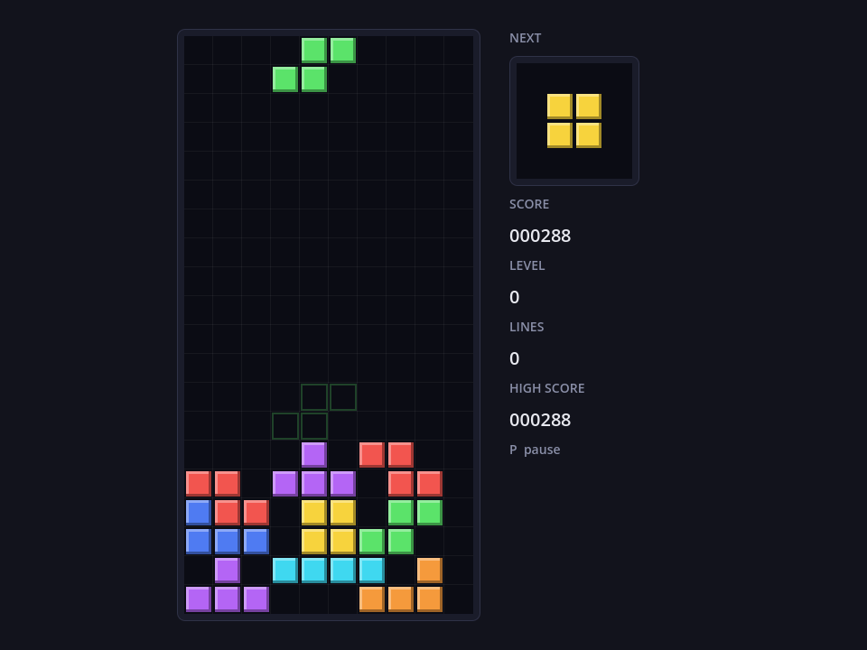

# Tetris

Classic Tetris in Godot 4.8 (GDScript): Super Rotation System with wall kicks, 7-bag randomizer,
NES gravity and scoring, and a persistent local high score.



## Features

- Seven tetrominoes with SRS rotation states and wall kicks
- 7-bag randomizer, next-piece preview, ghost landing outline
- NES gravity curve; line scores 40/100/300/1200 times (level + 1); level up every 10 lines
- Soft drop, hard drop, delayed auto shift, pause, classic lock on landing
- High score saved to `user://high_score.cfg`, shown on the menu and the HUD
- Main menu control guide generated from the input map, so it always matches the bindings

Controls: Left/Right or A/D move, Up or X rotate, Z rotate back, Down or S soft drop,
Space hard drop, P or Esc pause.

## Run

Requires Godot 4.8 (developed on 4.8.dev5) with the GL Compatibility renderer. Open
`project.godot` in the editor and press Play, or from the project root:

```bash
godot --path .
```

## Tests

GdUnit4 is vendored under `addons/gdUnit4`, so a fresh clone runs the suite with nothing else installed:

```bash
tools/test.sh
```

That wraps `godot --headless -s addons/gdUnit4/bin/GdUnitCmdTool.gd --ignoreHeadlessMode -a test`.
Set `GODOT_BIN` if `godot` is not on your PATH; it defaults to the macOS app bundle. 64 tests in
7 suites cover rotation, collision, line clears, scoring, high-score persistence, and a scene-runner
playthrough from the first piece to game over. Reports land in `reports/`.

## License

MIT, see `LICENSE`. GdUnit4 is MIT-licensed by its authors.
